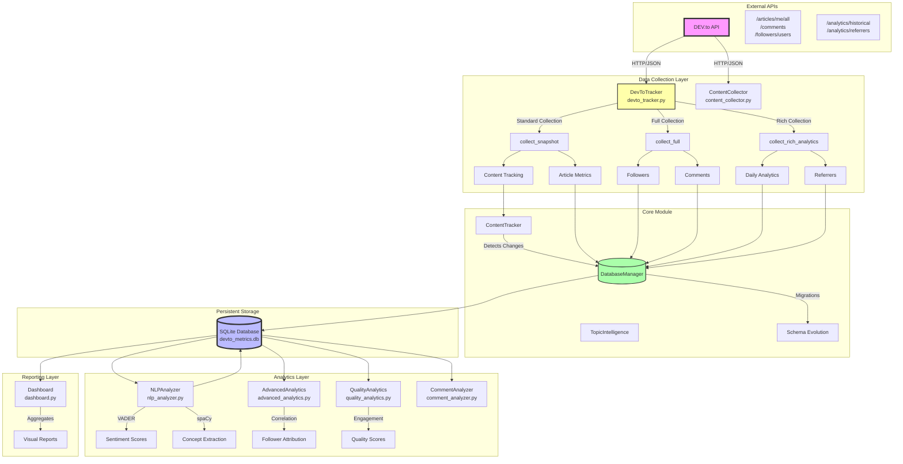
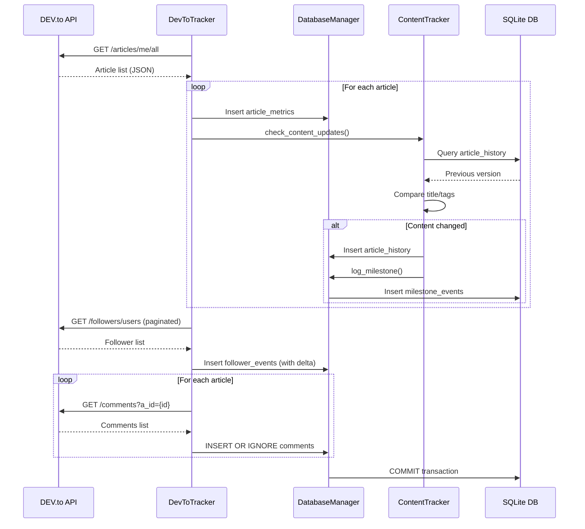
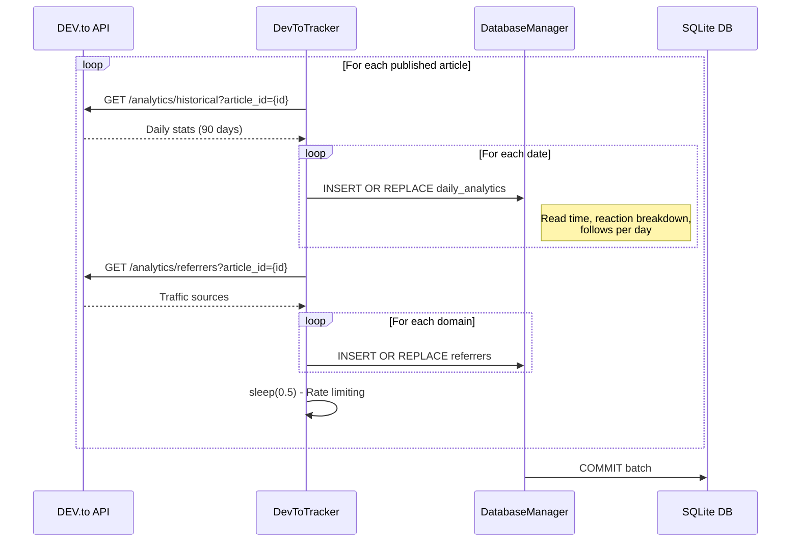
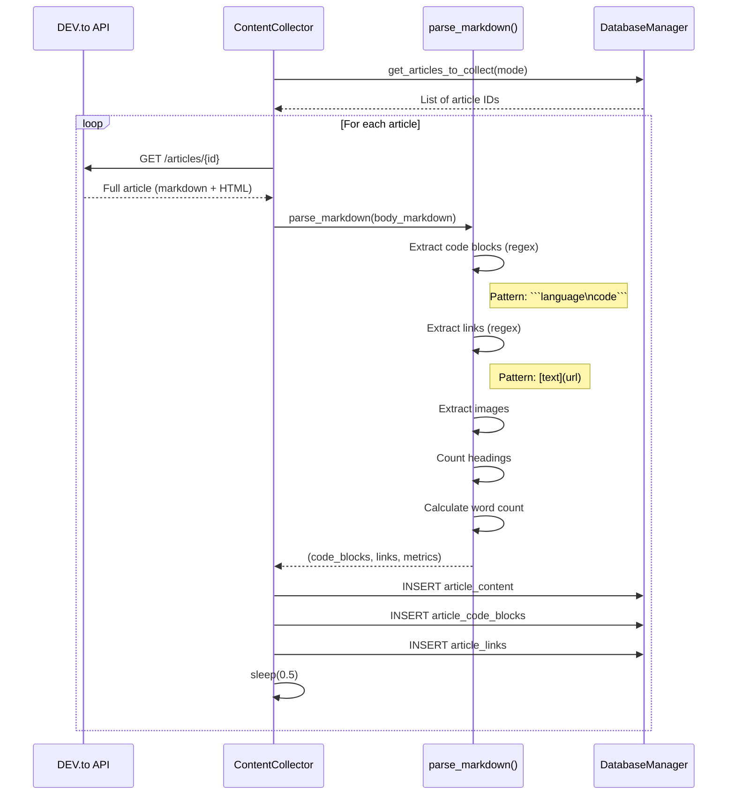
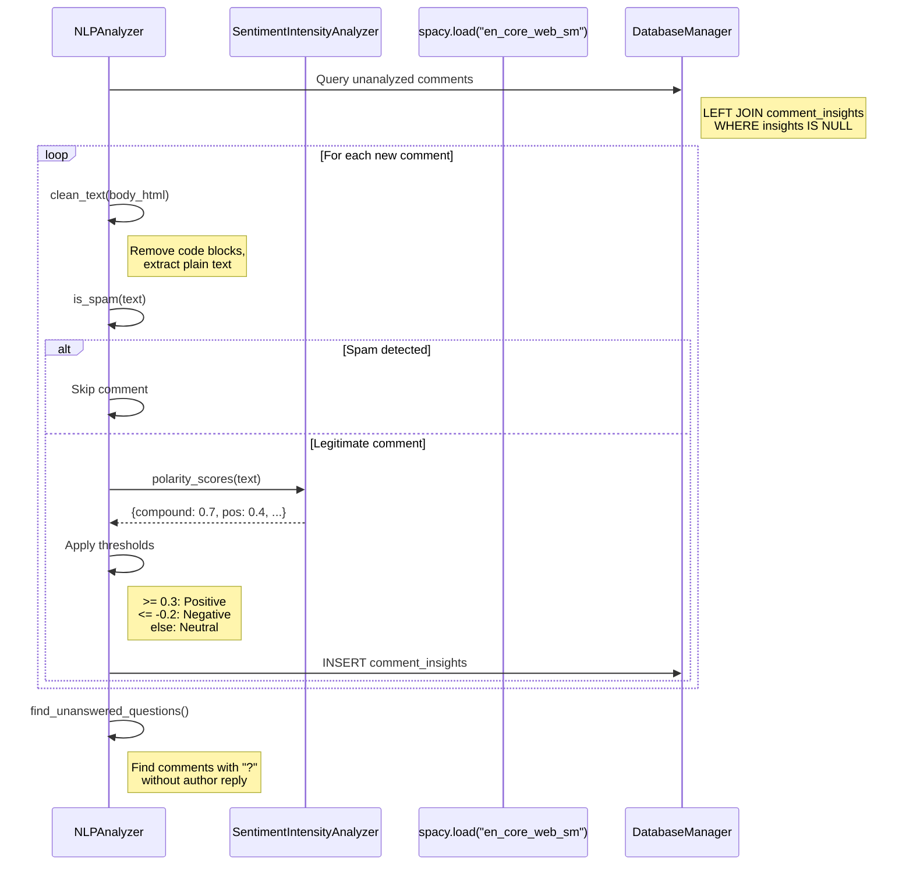
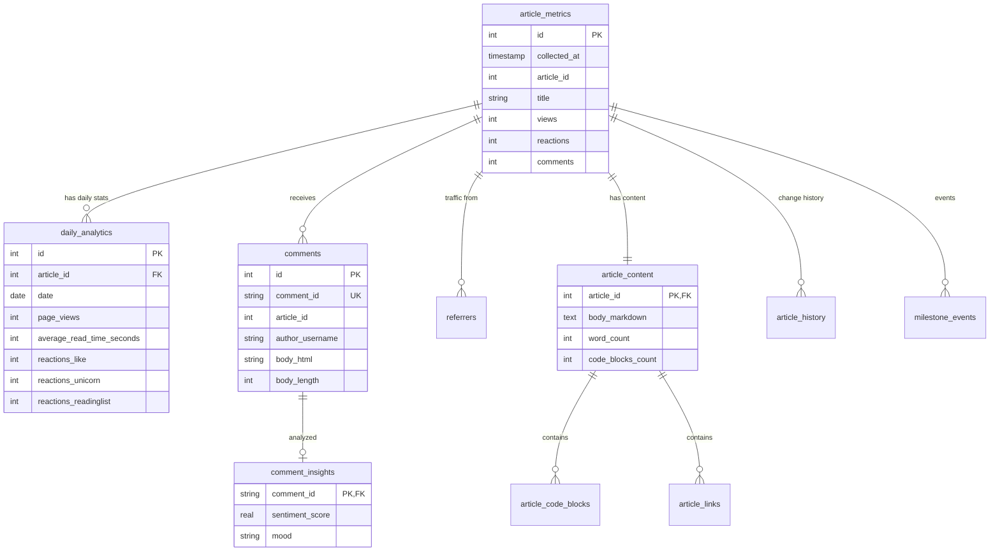

# DEV.to Analytics System - Technical Documentation

## Table of Contents
1. [Architecture Overview](#architecture-overview)
2. [System Architecture Diagram](#system-architecture-diagram)
3. [Data Flow](#data-flow)
4. [Database Schema](#database-schema)
5. [Modules & Classes](#modules--classes)
6. [External APIs](#external-apis)
7. [Key Algorithms](#key-algorithms)
8. [Business Logic & Thresholds](#business-logic--thresholds)
9. [Code Patterns to Preserve](#code-patterns-to-preserve)

---

## Architecture Overview

The DEV.to Analytics System is a Python-based data collection and analytics platform that tracks blog metrics from DEV.to. It follows a modular architecture with clear separation of concerns:

### Core Components

```
devto_tracker.py          # Main data collector (orchestrator)
content_collector.py      # Article content harvester
nlp_analyzer.py          # Sentiment & NLP analysis
advanced_analytics.py    # Correlation & attribution logic
quality_analytics.py     # Read time & engagement quality
dashboard.py             # Consolidated reporting
comment_analyzer.py      # Comment engagement analysis
core/
  ├── database.py        # Database abstraction & migrations
  ├── content_tracker.py # Content change detection
  └── topic_intelligence.py # Author DNA profiling
```

### Design Patterns

1. **Manager Pattern**: `DatabaseManager` centralizes all DB operations
2. **Tracker Pattern**: Specialized collectors for different data types
3. **Incremental Analysis**: NLP analyzer processes only new data
4. **Dual Collection Modes**: Standard (frequent) vs Rich (expensive API calls)

---

## System Architecture Diagram



---

## Data Flow

### 1. Collection Flow (Standard Mode)



### 2. Rich Collection Flow



### 3. Content Collection Flow



### 4. NLP Analysis Flow



---

## Database Schema

### Core Tables

#### **article_metrics**
Primary snapshot table for article performance over time.

```sql
CREATE TABLE article_metrics (
    id INTEGER PRIMARY KEY AUTOINCREMENT,
    collected_at TIMESTAMP NOT NULL,
    article_id INTEGER NOT NULL,
    title TEXT,
    slug TEXT,
    published_at TIMESTAMP,
    views INTEGER,
    reactions INTEGER,
    comments INTEGER,
    reading_time_minutes INTEGER,
    tags TEXT,
    is_deleted INTEGER DEFAULT 0,
    UNIQUE(collected_at, article_id)
);
CREATE INDEX idx_article_metrics_date ON article_metrics(collected_at);
CREATE INDEX idx_article_metrics_article ON article_metrics(article_id);
```

**Purpose**: Time-series snapshots. Each collection creates new rows for all articles.

**Key Columns**:
- `collected_at`: When this snapshot was taken (ISO timestamp)
- `article_id`: DEV.to article ID (not unique - many snapshots per article)
- `is_deleted`: Soft delete flag (0=active, 1=deleted)

---

#### **follower_events**
Tracks follower count over time with delta calculation.

```sql
CREATE TABLE follower_events (
    id INTEGER PRIMARY KEY AUTOINCREMENT,
    collected_at TIMESTAMP NOT NULL,
    follower_count INTEGER,
    new_followers_since_last INTEGER,
    UNIQUE(collected_at)
);
```

**Purpose**: Track follower growth. Delta calculated by comparing to previous snapshot.

**Business Logic**: 
```python
# From devto_tracker.py:133-143
cursor = conn.execute("""
    SELECT follower_count FROM follower_events 
    ORDER BY collected_at DESC LIMIT 1
""")
last = cursor.fetchone()
delta = count - last['follower_count'] if last else 0
```

---

#### **comments**
All comments across all articles.

```sql
CREATE TABLE comments (
    id INTEGER PRIMARY KEY AUTOINCREMENT,
    collected_at TIMESTAMP NOT NULL,
    comment_id TEXT UNIQUE,
    article_id INTEGER,
    article_title TEXT,
    created_at TIMESTAMP,
    author_username TEXT,
    author_name TEXT,
    body_html TEXT,
    body_length INTEGER,
    body_text TEXT,
    body_markdown TEXT
);
CREATE INDEX idx_comments_article ON comments(article_id);
CREATE INDEX idx_comments_date ON comments(collected_at);
```

**Purpose**: Store comment content for engagement and sentiment analysis.

**Key Pattern**: `INSERT OR IGNORE` ensures idempotency (comment_id is unique).

---

#### **daily_analytics**
Rich daily breakdown from undocumented API endpoint.

```sql
CREATE TABLE daily_analytics (
    id INTEGER PRIMARY KEY AUTOINCREMENT,
    article_id INTEGER NOT NULL,
    date DATE NOT NULL,
    page_views INTEGER,
    average_read_time_seconds INTEGER,
    total_read_time_seconds INTEGER,
    reactions_total INTEGER,
    reactions_like INTEGER,
    reactions_readinglist INTEGER,
    reactions_unicorn INTEGER,
    comments_total INTEGER,
    follows_total INTEGER,
    collected_at TIMESTAMP NOT NULL,
    UNIQUE(article_id, date)
);
```

**Purpose**: Detailed daily metrics (read time, reaction breakdown).

**⚠️ Data Period**: Last 90 days only from DEV.to API.

**Key Pattern**: `INSERT OR REPLACE` allows reprocessing.

---

#### **referrers**
Traffic source tracking.

```sql
CREATE TABLE referrers (
    id INTEGER PRIMARY KEY AUTOINCREMENT,
    article_id INTEGER NOT NULL,
    domain TEXT,
    count INTEGER NOT NULL,
    collected_at TIMESTAMP NOT NULL,
    UNIQUE(article_id, domain, collected_at)
);
```

**Purpose**: Understand traffic sources (Google, Twitter, etc.)

---

### Content Tables

#### **article_content**
Full article body storage for NLP.

```sql
CREATE TABLE article_content (
    article_id INTEGER PRIMARY KEY,
    body_markdown TEXT NOT NULL,
    body_html TEXT,
    word_count INTEGER,
    char_count INTEGER,
    code_blocks_count INTEGER,
    links_count INTEGER,
    images_count INTEGER,
    headings_count INTEGER,
    collected_at TIMESTAMP NOT NULL,
    FOREIGN KEY (article_id) REFERENCES article_metrics(article_id)
);
```

---

#### **article_code_blocks**
Extracted code snippets.

```sql
CREATE TABLE article_code_blocks (
    id INTEGER PRIMARY KEY AUTOINCREMENT,
    article_id INTEGER NOT NULL,
    language TEXT,
    code_text TEXT,
    line_count INTEGER,
    block_order INTEGER,
    FOREIGN KEY (article_id) REFERENCES article_metrics(article_id)
);
```

**Extraction Logic** (from content_collector.py:208-219):
```python
code_pattern = r'```(\w+)?\n(.*?)```'
for i, match in enumerate(re.finditer(code_pattern, markdown, re.DOTALL), 1):
    language = match.group(1) or "text"
    code_text = match.group(2).strip()
    line_count = len(code_text.split('\n'))
    
    code_blocks.append({
        'language': language,
        'code_text': code_text,
        'line_count': line_count,
        'block_order': i
    })
```

---

#### **article_links**
All links in articles.

```sql
CREATE TABLE article_links (
    id INTEGER PRIMARY KEY AUTOINCREMENT,
    article_id INTEGER NOT NULL,
    url TEXT NOT NULL,
    link_text TEXT,
    link_type TEXT,
    FOREIGN KEY (article_id) REFERENCES article_metrics(article_id)
);
```

**Link Classification** (from content_collector.py:228-237):
```python
if url.startswith('#'):
    link_type = 'anchor'
elif url.startswith('http'):
    if 'dev.to' in url:
        link_type = 'internal'
    else:
        link_type = 'external'
else:
    link_type = 'relative'
```

---

### Analysis Tables

#### **comment_insights**
NLP sentiment analysis results.

```sql
CREATE TABLE comment_insights (
    comment_id TEXT PRIMARY KEY,
    sentiment_score REAL,
    mood TEXT,
    analyzed_at TIMESTAMP DEFAULT CURRENT_TIMESTAMP,
    FOREIGN KEY (comment_id) REFERENCES comments (comment_id)
);
```

**Sentiment Thresholds** (from nlp_analyzer.py:127-132):
```python
vs = vader.polarity_scores(text)
score = vs['compound']  # Range: -1.0 to +1.0

if score >= 0.3:
    mood = "🌟 Positif"
elif score <= -0.2:
    mood = "😟 Négatif"
else:
    mood = "😐 Neutre"
```

---

#### **article_history**
Content change tracking (title, tags).

```sql
CREATE TABLE article_history (
    id INTEGER PRIMARY KEY AUTOINCREMENT,
    article_id INTEGER NOT NULL,
    title TEXT,
    slug TEXT,
    tags TEXT,
    content_hash TEXT,
    changed_at TIMESTAMP DEFAULT CURRENT_TIMESTAMP,
    edited_at_api TEXT
);
```

**Purpose**: Detect when authors modify titles/tags post-publication.

---

#### **milestone_events**
Significant events (title changes, curations).

```sql
CREATE TABLE milestone_events (
    id INTEGER PRIMARY KEY AUTOINCREMENT,
    article_id INTEGER,
    event_type TEXT, 
    description TEXT,
    occurred_at TIMESTAMP DEFAULT CURRENT_TIMESTAMP
);
```

---

### Relationship Diagram



---

## Modules & Classes

### 1. devto_tracker.py

**Class: `DevToTracker`**

Main orchestrator for data collection.

```python
class DevToTracker:
    def __init__(self, api_key, db_path="devto_metrics.db"):
        self.api_key = api_key
        self.headers = {"api-key": api_key}
        self.base_url = "https://dev.to/api"
        self.db = DatabaseManager(db_path)
        self.content_tracker = ContentTracker(self.db)
```

**Key Methods**:

| Method | Purpose | Frequency |
|--------|---------|-----------|
| `collect_snapshot()` | Metrics + content tracking | Hourly |
| `collect_full()` | Metrics + followers + comments | Daily |
| `collect_rich_analytics()` | Historical + referrers | Weekly |
| `collect_all()` | Everything | Manual |

**Important Pattern**: Transaction management
```python
conn = self.db.get_connection()
# ... multiple inserts ...
conn.commit()
conn.close()
```

**Rate Limiting**:
```python
time.sleep(0.5)  # Between API calls for rich analytics
```

---

### 2. content_collector.py

**Class: `ContentCollector`**

Harvests article content for NLP analysis.

**Key Methods**:

- `init_db()`: Creates content tables
- `get_articles_to_collect(mode)`: Determines which articles to fetch
  - `mode="all"`: All published articles
  - `mode="new"`: Only articles not in article_content
  - `mode="specific"`: Single article by ID
- `fetch_article_content(article_id)`: API call to get full content
- `parse_markdown(markdown)`: Extract code/links/metrics
- `save_article_content()`: Store parsed results

**Parsing Pattern** (content_collector.py:193-269):
```python
def parse_markdown(self, markdown: str) -> Tuple[List[Dict], List[Dict], Dict]:
    code_blocks = []
    links = []
    
    # Extract code blocks: ```language\ncode```
    code_pattern = r'```(\w+)?\n(.*?)```'
    for i, match in enumerate(re.finditer(code_pattern, markdown, re.DOTALL), 1):
        # ... extract details ...
        code_blocks.append({...})
    
    # Extract links: [text](url)
    link_pattern = r'\[([^\]]+)\]\(([^\)]+)\)'
    for match in re.finditer(link_pattern, markdown):
        # ... classify link type ...
        links.append({...})
    
    # Calculate metrics (word count without code)
    text_without_code = re.sub(code_pattern, '', markdown, flags=re.DOTALL)
    words = text_without_code.split()
    
    metrics = {
        'word_count': len(words),
        'char_count': len(markdown),
        'code_blocks_count': len(code_blocks),
        # ...
    }
    
    return code_blocks, links, metrics
```

---

### 3. nlp_analyzer.py

**Class: `NLPAnalyzer`**

Sentiment analysis and question detection.

**Dependencies**:
- `vaderSentiment`: For sentiment scoring
- `spacy` (en_core_web_sm): For concept extraction
- `BeautifulSoup`: HTML cleaning

**Key Methods**:

- `clean_text(html)`: Strips code blocks from comment HTML
- `is_spam(text)`: Pragmatic spam filter
- `find_unanswered_questions()`: Finds reader questions without author replies
- `run()`: Incremental analysis (only new comments)

**Spam Detection** (nlp_analyzer.py:50-59):
```python
def is_spam(self, text):
    spam_keywords = ['investigator', 'hack', 'whatsapp', 'kasino', 'slot', '777', 'putar', 'kaya']
    t = text.lower()
    suspicious_patterns = ["🎡", "🎰", "💰"]
    
    if any(p in t for p in suspicious_patterns): return True
    if any(k in t for k in spam_keywords): return True
    if "@" in t and ".com" in t and "gmail" in t: return True
    return False
```

**Incremental Processing Pattern**:
```python
query = """
    SELECT c.comment_id, c.article_title, c.body_html 
    FROM comments c
    LEFT JOIN comment_insights i ON c.comment_id = i.comment_id
    WHERE i.comment_id IS NULL AND c.author_username != ?
"""
cursor.execute(query, (self.author_id,))
rows = cursor.fetchall()
```

**Unanswered Questions Detection** (nlp_analyzer.py:61-90):
```python
query = """
    SELECT q.article_title, q.author_username, q.body_html, q.created_at
    FROM comments q
    WHERE q.body_html LIKE '%?%' 
    AND q.author_username != ?
    AND NOT EXISTS (
        SELECT 1 FROM comments a 
        WHERE a.article_id = q.article_id 
        AND a.author_username = ? 
        AND a.created_at > q.created_at
    )
    ORDER BY q.created_at DESC
"""
```

---

### 4. advanced_analytics.py

**Class: `AdvancedAnalytics`**

Correlation analysis and follower attribution.

**Key Methods**:

1. **`article_follower_correlation()`**: Calculates follower gain per article using ±6h window around publication.

**Window Logic** (advanced_analytics.py:31-45):
```python
# Start: J+0 (publication day)
start = conn.execute("""
    SELECT follower_count FROM follower_events 
    WHERE julianday(collected_at) BETWEEN julianday(?) - 0.25 AND julianday(?) + 0.25
    ORDER BY ABS(julianday(collected_at) - julianday(?)) ASC LIMIT 1
""", (pub_date, pub_date, pub_date)).fetchone()

# End: J+7 (7 days later)
target_end = (datetime.fromisoformat(pub_date) + timedelta(days=7)).isoformat()
end = conn.execute("""...same pattern...""").fetchone()

if start and end:
    gain = end['follower_count'] - start['follower_count']
```

2. **`comment_engagement_correlation()`**: Analyzes impact of author replies on engagement.

3. **`weighted_follower_attribution(hours=168)`**: **Most Important Algorithm**

**Weighted Attribution Algorithm** (advanced_analytics.py:118-227):

**Purpose**: Distribute new followers to articles based on their share of traffic.

**Logic**:
```python
# 1. Find follower gain in time window
f_start = conn.execute("""
    SELECT follower_count FROM follower_events 
    ORDER BY ABS(strftime('%s', collected_at) - strftime('%s', ?)) ASC LIMIT 1
""", (start_time.isoformat(),)).fetchone()

f_end = ...similar...
total_gain = f_end['follower_count'] - f_start['follower_count']

# 2. Calculate view gain per article
for art in articles:
    v_start = conn.execute("""
        SELECT views FROM article_metrics 
        WHERE article_id = ?
        ORDER BY ABS(strftime('%s', collected_at) - strftime('%s', ?)) ASC LIMIT 1
    """, (art['article_id'], start_time.isoformat())).fetchone()
    
    v_end = ...similar...
    gain = v_end['views'] - v_start['views']
    global_traffic_gain += gain

# 3. Attribution = (article_views / total_views) * total_followers
for item in attribution_data:
    share = item['views_gain'] / global_traffic_gain
    attributed_followers = share * total_gain
```

**Key Insight**: Uses "Share of Voice" - articles get credit proportional to their traffic contribution.

4. **`velocity_milestone_correlation()`**: Analyzes velocity (views/hour) before/after milestones.

**Velocity Calculation** (advanced_analytics.py:98-116):
```python
def _calculate_period_velocity(self, article_id, event_time, hours_offset):
    # Get metrics in time window
    metrics = conn.execute("""
        SELECT views, collected_at FROM article_metrics 
        WHERE article_id = ? AND collected_at BETWEEN ? AND ?
        ORDER BY collected_at ASC
    """, (article_id, t_min.isoformat(), t_max.isoformat())).fetchall()
    
    if len(metrics) < 2: return 0.0
    
    v_diff = abs(metrics[-1]['views'] - metrics[0]['views'])
    return v_diff / abs(hours_offset)  # views per hour
```

---

### 5. quality_analytics.py

**Class: `QualityAnalytics`**

Read time and engagement quality analysis.

**Key Methods**:

1. **`show_read_time_analysis()`**: Completion rate calculation.

```python
completion = (avg_read / length_seconds) * 100
completion = min(100, completion)  # Cap at 100%
```

2. **`show_reaction_breakdown()`**: Analyzes like/unicorn/bookmark ratios.

**Important Fix** (quality_analytics.py:99-130):
```python
# daily_analytics contains INCREMENTAL data (new reactions per day)
# NOT cumulative! We need to SUM, not MAX
reactions_like_since_pub = conn.execute("""
    SELECT SUM(reactions_like)
    FROM daily_analytics da2
    WHERE da2.article_id = am.article_id
    AND da2.date >= date(am.published_at)
""").fetchone()
```

**Gap Analysis**:
```python
gap = lifetime_reactions - breakdown_sum

# Gap < 0: People unliked (history shows original, lifetime shows current)
# Gap > 0: Recent reactions not yet synced or delay in daily_analytics
```

3. **`show_quality_scores()`**: Composite quality metric.

**Quality Score Formula** (quality_analytics.py:296-302):
```python
completion = min(100, (avg_read / length_seconds) * 100)
engagement = ((reactions + comments) / views) * 100

# Weighted average: 70% completion, 30% engagement
quality_score = (completion * 0.7) + (min(engagement, 20) * 1.5)
```

**Rationale**: Completion matters more for quality. Cap engagement to prevent outliers skewing score.

---

### 6. dashboard.py

**Class: `DevToDashboard`**

Consolidated reporting interface.

**Key Methods**:

- `show_full_dashboard()`: Main entry point
- `show_latest_article_detail()`: Detailed metrics for newest article
- `show_last_5_articles()`: Comparison table
- `show_global_trend()`: 30-day vs previous 30-day comparison
- `show_significant_insights()`: Auto-detected notable events
- `show_top_commenters()`: Engagement analysis with quality scores
- `show_article_comparison()`: Performance benchmarking
- `display_author_dna()`: Calls TopicIntelligence

**Insight Detection Examples**:

**Restarting Article** (dashboard.py:320-341):
```python
cursor.execute("""
    SELECT a1.article_id, a1.title, a1.views as recent_views, a2.views as old_views
    FROM article_metrics a1
    JOIN article_metrics a2 ON a1.article_id = a2.article_id
    WHERE a1.collected_at >= datetime('now', '-7 days')
    AND a2.collected_at <= datetime('now', '-14 days')
    AND a1.views > a2.views * 1.5  -- 50% growth threshold
    AND a2.views > 50              -- Minimum baseline
    GROUP BY a1.article_id
    ORDER BY (a1.views - a2.views) DESC
    LIMIT 1
""")
```

**Commenter Quality Score** (dashboard.py:442-447):
```python
quality_score = min(10, (avg_length / 100) * articles_commented)

# Combines depth (length) with breadth (diversity)
```

---

### 7. comment_analyzer.py

**Class: `CommentAnalyzer`**

Deep-dive comment engagement analysis.

**Key Methods**:

1. **`analyze_article_comments(article_id)`**: Single article deep dive
   - Timeline analysis
   - Top commenters
   - Velocity (comments/day)
   - Engagement depth (long vs short comments)

2. **`compare_article_engagement()`**: Cross-article comparison

3. **`find_engaged_readers()`**: Identifies loyal community members

4. **`comment_timing_analysis()`**: When do comments typically arrive?

**Timing Buckets** (comment_analyzer.py:218-233):
```python
hours_diff = (comment_time - publication_time).total_seconds() / 3600

if hours_diff < 24:
    time_buckets['0-24h'] += 1
elif hours_diff < 72:
    time_buckets['24-72h'] += 1
elif hours_diff < 168:  # 7 days
    time_buckets['3-7 days'] += 1
elif hours_diff < 720:  # 30 days
    time_buckets['1-4 weeks'] += 1
else:
    time_buckets['1+ months'] += 1
```

---

### 8. core/database.py

**Class: `DatabaseManager`**

Central database abstraction layer.

**Key Responsibilities**:
- Connection management with row_factory
- Schema migrations
- Utility methods for common queries

**Migration Pattern** (database.py:16-61):
```python
def _run_migrations(self):
    conn = self.get_connection()
    cursor = conn.cursor()
    
    # Try-except pattern for backward-compatible schema evolution
    try:
        cursor.execute("SELECT is_deleted FROM article_metrics LIMIT 1")
    except sqlite3.OperationalError:
        print("🔧 Migration : Ajout de 'is_deleted' dans article_metrics...")
        cursor.execute("ALTER TABLE article_metrics ADD COLUMN is_deleted INTEGER DEFAULT 0")
    
    # CREATE TABLE IF NOT EXISTS for new tables
    cursor.execute("""
        CREATE TABLE IF NOT EXISTS article_history (
            id INTEGER PRIMARY KEY AUTOINCREMENT,
            ...
        )
    """)
```

**Connection Pattern** (database.py:10-14):
```python
def get_connection(self):
    conn = sqlite3.connect(self.db_path)
    conn.row_factory = sqlite3.Row  # Enables column name access
    return conn

# Usage:
row = cursor.fetchone()
value = row['column_name']  # Dict-like access
```

**Utility Methods**:
- `log_milestone(article_id, event_type, description)`: Event logging
- `get_all_active_articles()`: Query helper with soft-delete filter
- `get_latest_article_snapshot(article_id)`: Latest metrics

---

### 9. core/content_tracker.py

**Class: `ContentTracker`**

Content change detection system.

**Purpose**: Detect when authors modify articles post-publication (title/tags).

**Algorithm** (content_tracker.py:20-53):
```python
def check_content_updates(self, article_id, current_title, current_tags, conn=None):
    # Get last known version
    cursor = conn.execute("""
        SELECT title, tags FROM article_history 
        WHERE article_id = ? 
        ORDER BY changed_at DESC LIMIT 1
    """, (article_id,))
    last_version = cursor.fetchone()
    
    # Compare
    if not last_version or last_version['title'] != current_title or last_version['tags'] != current_tags:
        # Save new version
        conn.execute("""
            INSERT INTO article_history (article_id, title, tags, changed_at) 
            VALUES (?, ?, ?, ?)
        """, (article_id, current_title, current_tags, datetime.now()))
        
        # If title changed (major event), log milestone
        if last_version and last_version['title'] != current_title:
            description = f"Title change: '{last_version['title']}' → '{current_title}'"
            self.db.log_milestone(article_id, 'title_change', description, conn)
```

**Pattern**: Always called within existing transaction (conn parameter).

---

### 10. core/topic_intelligence.py

**Class: `TopicIntelligence`**

Author DNA profiling - categorizes content themes.

**Theme Definition** (topic_intelligence.py:11-15):
```python
self.themes = {
    "Expertise Tech": ["sql", "database", "python", "cloud", "docker", "vps", "astro", "hugo", "vector", "cte"],
    "Human & Career": ["cv", "career", "feedback", "developer", "learning", "growth"],
    "Culture & Agile": ["agile", "scrum", "performance", "theater", "laziness", "management"]
}
```

**Classification Logic** (topic_intelligence.py:17-29):
```python
def _get_article_theme(self, title, tags):
    text = (title + " " + tags).lower()
    scores = {theme: 0 for theme in self.themes}
    
    # Count keyword matches
    for theme, keywords in self.themes.items():
        for kw in keywords:
            if kw in text:
                scores[theme] += 1
    
    # Return theme with most matches
    max_theme = max(scores, key=scores.get)
    return max_theme if scores[max_theme] > 0 else "Free Exploration"
```

**DNA Report** (topic_intelligence.py:31-67):
```python
def analyze_dna(self):
    articles = conn.execute("""
        SELECT article_id, title, tags, MAX(views) as views, MAX(reactions) as reactions 
        FROM article_metrics GROUP BY article_id
    """).fetchall()
    
    dna_report = {theme: {"count": 0, "views": 0, "reactions": 0} for theme in self.themes}
    
    for art in articles:
        theme = self._get_article_theme(art['title'], art['tags'] or "")
        dna_report[theme]["count"] += 1
        dna_report[theme]["views"] += art['views']
        dna_report[theme]["reactions"] += art['reactions']
    
    # Display report with avg views and engagement % per theme
    for theme, stats in dna_report.items():
        if stats['count'] > 0:
            avg_views = stats['views'] / stats['count']
            engage = (stats['reactions'] / stats['views'] * 100) if stats['views'] > 0 else 0
            print(f"{theme:<25} {stats['count']:<10} {avg_views:<12.0f} {engage:<12.2f}%")
```

---

## External APIs

### DEV.to API

**Base URL**: `https://dev.to/api`

**Authentication**:
```python
headers = {"api-key": api_key}
```

**Rate Limiting**: Self-imposed 0.5s delay between expensive calls.

---

### Documented Endpoints

#### 1. Get User's Articles
```
GET /articles/me/all?per_page=1000
```

**Response**:
```json
[
  {
    "id": 123456,
    "title": "Article Title",
    "slug": "article-title",
    "published_at": "2024-01-15T10:00:00Z",
    "page_views_count": 1234,
    "public_reactions_count": 45,
    "comments_count": 12,
    "reading_time_minutes": 7,
    "tag_list": ["python", "tutorial"]
  }
]
```

**Used in**: `devto_tracker.py:22-27`, `content_collector.py`

---

#### 2. Get Article Comments
```
GET /comments?a_id={article_id}
```

**Response**:
```json
[
  {
    "id_code": "abc123",
    "created_at": "2024-01-16T12:30:00Z",
    "body_html": "<p>Great article!</p>",
    "user": {
      "username": "jane_dev",
      "name": "Jane Developer"
    }
  }
]
```

**Used in**: `devto_tracker.py:149-179`

---

#### 3. Get Followers (Paginated)
```
GET /followers/users?per_page=80&page={page}
```

**Response**:
```json
[
  {
    "id": 789,
    "username": "follower1",
    "name": "Follower Name"
  }
]
```

**Pagination Pattern** (devto_tracker.py:107-129):
```python
all_followers = []
page = 1

while True:
    r = requests.get(
        f"{self.base_url}/followers/users",
        headers=self.headers,
        params={"per_page": 80, "page": page}
    )
    if r.status_code != 200:
        break
    
    data = r.json()
    if not data:  # Empty page = end
        break
    
    all_followers.extend(data)
    page += 1

count = len(all_followers)
```

---

#### 4. Get Single Article (Full Content)
```
GET /articles/{article_id}
```

**Response**:
```json
{
  "id": 123456,
  "title": "Article Title",
  "body_markdown": "# Introduction\n\nArticle content...",
  "body_html": "<h1>Introduction</h1><p>Article content...</p>"
}
```

**Used in**: `content_collector.py:169-191`

---

### Undocumented Endpoints

⚠️ **Warning**: These endpoints are not in official docs. May break without notice.

#### 5. Historical Analytics
```
GET /analytics/historical?article_id={article_id}
```

**Response**:
```json
{
  "2024-01-15": {
    "page_views": {
      "total": 150,
      "average_read_time_in_seconds": 240,
      "total_read_time_in_seconds": 36000
    },
    "reactions": {
      "total": 12,
      "like": 8,
      "unicorn": 2,
      "readinglist": 2
    },
    "comments": {
      "total": 3
    },
    "follows": {
      "total": 1
    }
  },
  "2024-01-16": { ... }
}
```

**Data Period**: Last 90 days

**Used in**: `devto_tracker.py:181-215`

**Storage** (devto_tracker.py:190-213):
```python
for date_str, stats in data.items():
    conn.execute("""
        INSERT OR REPLACE INTO daily_analytics 
        (article_id, date, page_views, average_read_time_seconds, total_read_time_seconds,
         reactions_total, reactions_like, reactions_readinglist, reactions_unicorn,
         comments_total, follows_total, collected_at)
        VALUES (?, ?, ?, ?, ?, ?, ?, ?, ?, ?, ?, ?)
    """, (
        article_id, date_str,
        stats['page_views']['total'],
        stats['page_views'].get('average_read_time_in_seconds', 0),
        stats['page_views'].get('total_read_time_in_seconds', 0),
        stats['reactions']['total'],
        stats['reactions'].get('like', 0),
        stats['reactions'].get('readinglist', 0),
        stats['reactions'].get('unicorn', 0),
        stats['comments']['total'],
        stats['follows']['total'],
        timestamp
    ))
```

---

#### 6. Referrers (Traffic Sources)
```
GET /analytics/referrers?article_id={article_id}
```

**Response**:
```json
{
  "domains": [
    {
      "domain": "google.com",
      "count": 234
    },
    {
      "domain": "twitter.com",
      "count": 89
    }
  ]
}
```

**Used in**: `devto_tracker.py:217-237`

---

### API Usage Patterns

**Error Handling**:
```python
response = requests.get(url, headers=self.headers, timeout=10)

if response.status_code == 200:
    return response.json()
else:
    print(f"⚠️ API error {response.status_code}")
    return None
```

**Idempotency Pattern**:
```python
# Comments: INSERT OR IGNORE (comment_id is unique)
cursor.execute("""
    INSERT OR IGNORE INTO comments 
    (comment_id, article_id, author_username, body_html, collected_at, created_at) 
    VALUES (?, ?, ?, ?, ?, ?)
""", (c['id_code'], art['id'], ...))

# Daily analytics: INSERT OR REPLACE (allows reprocessing)
cursor.execute("""
    INSERT OR REPLACE INTO daily_analytics 
    (article_id, date, page_views, ...) 
    VALUES (?, ?, ?, ...)
""", (article_id, date_str, ...))
```

---

## Key Algorithms

### 1. Follower Attribution (Weighted)

**File**: `advanced_analytics.py:118-227`

**Purpose**: Fairly distribute new followers to articles based on traffic share.

**Algorithm**:

```
Input: time_window (e.g., last 168 hours)
Output: Followers attributed to each article

1. Find follower gain in time window:
   - f_start = follower_count at window start (closest snapshot)
   - f_end = follower_count at window end (closest snapshot)
   - total_gain = f_end - f_start

2. Calculate traffic gain per article:
   FOR EACH article:
       - v_start = views at window start
       - v_end = views at window end
       - views_gain = v_end - v_start
       - global_traffic_gain += views_gain

3. Distribute followers proportionally:
   FOR EACH article:
       - share = views_gain / global_traffic_gain
       - attributed_followers = share × total_gain

4. Sort by attributed_followers DESC
```

**Key Insight**: "Share of Voice" - articles driving traffic get credit for follower growth.

**Proximity Search Pattern**:
```python
# Find closest snapshot to target time (within 30-minute tolerance)
f_start_result = conn.execute("""
    SELECT follower_count, collected_at FROM follower_events 
    ORDER BY ABS(strftime('%s', collected_at) - strftime('%s', ?)) ASC LIMIT 1
""", (start_time.isoformat(),)).fetchone()
```

**Example Output**:
```
Total Gain: +15 followers | Total Traffic: 2,450 views
Intervalle réel : 168h0m
---------------------------------------------------
Article                      Views    Traffic %    Followers
---------------------------------------------------
Python Tutorial              1,200       49.0%          7.4
SQL Guide                      800       32.7%          4.9
Docker Intro                   450       18.4%          2.8
```

---

### 2. Sentiment Analysis (VADER)

**File**: `nlp_analyzer.py:103-147`

**Purpose**: Classify comment sentiment as Positive/Neutral/Negative.

**Algorithm**:

```
Input: comment body_html
Output: (sentiment_score, mood)

1. Clean text:
   - Parse HTML with BeautifulSoup
   - Remove <code> and <pre> blocks
   - Extract plain text

2. Spam check:
   IF contains spam keywords OR suspicious patterns:
       SKIP comment

3. Sentiment scoring (VADER):
   scores = vader.polarity_scores(text)
   compound = scores['compound']  # Range: -1.0 to +1.0

4. Apply calibrated thresholds:
   IF compound >= 0.3:
       mood = "🌟 Positif"
   ELIF compound <= -0.2:
       mood = "😟 Négatif"
   ELSE:
       mood = "😐 Neutre"

5. Store in comment_insights table
```

**Threshold Calibration**:
- **Positive**: ≥0.3 (stricter than default 0.05)
- **Negative**: ≤-0.2 (stricter than default -0.05)
- **Neutral**: Everything between

**Rationale**: Blog comments tend to be polite. Stricter thresholds reduce false positives.

**VADER Compound Score Interpretation**:
- ≥ 0.05: Positive (but we use 0.3)
- ≤ -0.05: Negative (but we use -0.2)
- Between: Neutral

---

### 3. Spam Detection

**File**: `nlp_analyzer.py:50-59`

**Purpose**: Filter out casino bots and spam.

**Algorithm**:

```python
def is_spam(self, text):
    spam_keywords = [
        'investigator', 'hack', 'whatsapp', 
        'kasino', 'slot', '777', 'putar', 'kaya'
    ]
    t = text.lower()
    suspicious_patterns = ["🎡", "🎰", "💰"]
    
    # Emoji check
    if any(p in t for p in suspicious_patterns): 
        return True
    
    # Keyword check
    if any(k in t for k in spam_keywords): 
        return True
    
    # Email pattern check
    if "@" in t and ".com" in t and "gmail" in t: 
        return True
    
    return False
```

**Pattern**: Pragmatic keyword + emoji filtering. Not ML-based.

---

### 4. Quality Score Calculation

**File**: `quality_analytics.py:260-328`

**Purpose**: Composite metric combining read completion and engagement.

**Algorithm**:

```
Input: article_id
Output: quality_score (0-100 scale)

1. Get metrics from daily_analytics (last 90 days):
   - avg_read_seconds
   - views_90d
   - reactions_90d
   - comments_90d

2. Calculate completion rate:
   length_seconds = reading_time_minutes × 60
   completion = MIN(100, (avg_read / length_seconds) × 100)

3. Calculate engagement rate:
   engagement = ((reactions + comments) / views) × 100

4. Weighted score:
   quality_score = (completion × 0.7) + (MIN(engagement, 20) × 1.5)
   
   # 70% weight on completion
   # 30% weight on engagement (capped at 20% to prevent outliers)
```

**Formula Explained**:
- **Completion**: Did readers finish the article?
- **Engagement**: Did they react/comment?
- **Weight**: 70/30 split - completion is primary quality indicator

**Example**:
```
Article: "Python Tutorial"
- Reading time: 7 minutes (420 seconds)
- Avg read time: 350 seconds
- Completion: 83.3%
- Engagement: 8.5%

quality_score = (83.3 × 0.7) + (8.5 × 1.5)
              = 58.3 + 12.75
              = 71.05
```

---

### 5. Article Follower Correlation (Time Window)

**File**: `advanced_analytics.py:16-51`

**Purpose**: Calculate follower gain attributed to each article within 7-day window.

**Algorithm**:

```
Input: article with published_at
Output: follower_gain (start → end)

1. Find follower count at publication (±6 hours tolerance):
   start = SELECT follower_count FROM follower_events
           WHERE julianday(collected_at) 
                 BETWEEN julianday(pub_date) - 0.25 
                 AND julianday(pub_date) + 0.25
           ORDER BY ABS(julianday(collected_at) - julianday(pub_date)) ASC
           LIMIT 1

2. Find follower count 7 days later (±6 hours tolerance):
   target_end = pub_date + 7 days
   end = SELECT follower_count FROM follower_events
         WHERE julianday(collected_at)
               BETWEEN julianday(target_end) - 0.25
               AND julianday(target_end) + 0.25
         ORDER BY ABS(julianday(collected_at) - julianday(target_end)) ASC
         LIMIT 1

3. Calculate gain:
   gain = end['follower_count'] - start['follower_count']
```

**Julian Day Conversion**: SQLite's `julianday()` converts timestamps to days since noon UTC on November 24, 4714 BC. Makes date arithmetic easier.

**0.25 = 6 hours** (0.25 days)

---

### 6. Velocity Calculation

**File**: `advanced_analytics.py:98-116`

**Purpose**: Calculate views per hour before/after milestone events.

**Algorithm**:

```
Input: article_id, event_time, hours_offset (+24 or -24)
Output: velocity (views per hour)

1. Define time window:
   IF hours_offset > 0:  # After event
       t_min = event_time
       t_max = event_time + hours_offset
   ELSE:  # Before event
       t_min = event_time + hours_offset  # Negative offset
       t_max = event_time

2. Get snapshots in window:
   metrics = SELECT views, collected_at 
             FROM article_metrics 
             WHERE article_id = ? 
             AND collected_at BETWEEN t_min AND t_max
             ORDER BY collected_at ASC

3. Calculate velocity:
   IF len(metrics) < 2:
       return 0.0
   
   v_diff = metrics[-1]['views'] - metrics[0]['views']
   velocity = v_diff / ABS(hours_offset)
```

**Example**:
- Article featured on newsletter (milestone event)
- Before (24h): 50 views → 150 views = 100 views / 24h = **4.17 views/hour**
- After (24h): 150 views → 850 views = 700 views / 24h = **29.17 views/hour**
- Impact: +600% velocity increase

---

### 7. Content Change Detection

**File**: `core/content_tracker.py:20-53`

**Purpose**: Detect when article title or tags are modified post-publication.

**Algorithm**:

```
Input: article_id, current_title, current_tags
Output: milestone event if title changed

1. Get last known version:
   last_version = SELECT title, tags 
                  FROM article_history 
                  WHERE article_id = ?
                  ORDER BY changed_at DESC 
                  LIMIT 1

2. Compare:
   IF last_version IS NULL OR 
      last_version['title'] != current_title OR 
      last_version['tags'] != current_tags:
       
       # Save new version
       INSERT INTO article_history (article_id, title, tags, changed_at)
       VALUES (?, ?, ?, NOW())
       
       # If title changed (major event)
       IF last_version AND last_version['title'] != current_title:
           description = f"Title change: '{old}' → '{new}'"
           INSERT INTO milestone_events (article_id, event_type, description)
           VALUES (?, 'title_change', ?)
```

**Pattern**: Incremental - only stores changes, not every snapshot.

---

## Business Logic & Thresholds

### Sentiment Analysis Thresholds

**File**: `nlp_analyzer.py:127-132`

| Threshold | Value | Rationale |
|-----------|-------|-----------|
| Positive | ≥ 0.3 | Blog comments tend polite; avoid false positives |
| Negative | ≤ -0.2 | Capture genuine criticism, not mild skepticism |
| Neutral | -0.2 to 0.3 | Default for most comments |

**Calibration Note**: Stricter than VADER defaults (±0.05) based on blog comment patterns.

---

### Spam Detection Keywords

**File**: `nlp_analyzer.py:52-53`

```python
spam_keywords = [
    'investigator',  # "Hire an investigator"
    'hack',          # "Hack accounts"
    'whatsapp',      # Contact scams
    'kasino', 'slot', '777', 'putar', 'kaya'  # Casino bots (Indonesian)
]
```

**Pattern**: Indonesian casino spam is common on DEV.to.

---

### Quality Score Weights

**File**: `quality_analytics.py:301-302`

| Component | Weight | Cap | Rationale |
|-----------|--------|-----|-----------|
| Completion | 70% | 100% | Primary quality indicator |
| Engagement | 30% | 20% | Prevents outliers from skewing score |

**Formula**:
```python
quality_score = (completion * 0.7) + (min(engagement, 20) * 1.5)
```

**Example Scenarios**:

| Article | Completion | Engagement | Quality Score |
|---------|------------|------------|---------------|
| Deep Tutorial | 85% | 4% | 65.5 |
| Viral Meme | 40% | 25% | 58.0 (engagement capped) |
| Perfect Article | 95% | 8% | 78.5 |

---

### Article Restarting Detection

**File**: `dashboard.py:320-341`

| Threshold | Value | Purpose |
|-----------|-------|---------|
| Growth | +50% | Significant traffic increase |
| Baseline | >50 views | Avoid noise from tiny samples |
| Time window | 7 days recent vs 14 days old | Compare last week to previous week |

**SQL Logic**:
```sql
WHERE a1.views > a2.views * 1.5  -- 50% growth
AND a2.views > 50                -- Minimum baseline
```

---

### Follower Attribution Time Windows

**File**: `advanced_analytics.py:118-227`

| Parameter | Default | Purpose |
|-----------|---------|---------|
| Analysis period | 168 hours (7 days) | Weekly attribution report |
| Snapshot tolerance | 30 minutes | Acceptable gap for closest snapshot |
| Follower window | J+0 to J+7 | 7-day attribution window per article |

**Rationale**: 7 days captures immediate impact + long-tail discovery.

---

### Velocity Milestone Correlation

**File**: `advanced_analytics.py:79-116`

| Parameter | Value | Purpose |
|-----------|-------|---------|
| Before window | -24 hours | Baseline velocity |
| After window | +24 hours | Impact velocity |
| Impact calculation | ((after - before) / before) × 100 | Percentage change |
| Zero-division handling | 100% if before=0, after>0 | Handle cold start |

---

### Comment Engagement Metrics

**File**: `dashboard.py:442-461`

**Commenter Quality Score**:
```python
quality_score = min(10, (avg_length / 100) * articles_commented)
```

| Factor | Weight | Rationale |
|--------|--------|-----------|
| Average length | Linear | Depth of engagement |
| Articles commented | Multiplicative | Breadth of engagement |
| Max score | 10 | Normalization |

**Sentiment Classification**:

| Length | Sentiment |
|--------|-----------|
| >500 chars | 🔥 Passionate |
| 300-500 | 💬 Engaged |
| 100-300 | 👍 Interested |
| <100 | ✓ Basic |

---

### Data Period Limitations

**Daily Analytics** (from `/analytics/historical`):
- **Period**: Last 90 days only
- **Affects**: Read time, reaction breakdown, follows per day
- **Workaround**: None - DEV.to API limitation

**Article Metrics** (from `/articles/me/all`):
- **Period**: Lifetime
- **Covers**: Total views, reactions, comments

**Implication**: For articles >90 days old, reaction breakdown may be incomplete.

---

### Rate Limiting

**File**: `devto_tracker.py:97`

```python
time.sleep(0.5)  # 500ms delay between rich analytics calls
```

**Rationale**: 
- Standard collection: No delay (fast endpoints)
- Rich collection: 0.5s delay (undocumented endpoints)
- Manual testing showed no issues at 2 requests/second

---

### Engagement Thresholds

**File**: `dashboard.py:373-382`

**Best Engagement Criteria**:
- Minimum views: 50
- Published within: 60 days
- Metric: `(comments / views) × 100`

**Top Commenter Criteria**:
- Minimum comments: 2
- Sorted by: `comment_count DESC, avg_length DESC`

---

### Long-Tail Detection

**File**: `quality_analytics.py:212-258`

**Criteria**:
- Published >30 days ago
- Recent views (last 30 days) >50
- Sorted by recent views DESC

**Trend Calculation**:
```python
if older_views > 0:
    trend_pct = ((recent - older) / older) * 100
else:
    trend = "NEW"
```

---

## Code Patterns to Preserve

### 1. Row Factory Pattern

**Why**: Enables dict-like column access instead of numeric indices.

```python
# Setup (database.py:10-14)
def get_connection(self):
    conn = sqlite3.connect(self.db_path)
    conn.row_factory = sqlite3.Row
    return conn

# Usage
row = cursor.fetchone()
value = row['column_name']  # Clean and readable
# vs value = row[3]  # Fragile
```

---

### 2. INSERT OR IGNORE (Idempotency)

**Why**: Safe reprocessing without duplicates.

```python
# Comments (devto_tracker.py:164-175)
cursor.execute("""
    INSERT OR IGNORE INTO comments 
    (comment_id, article_id, author_username, body_html, collected_at, created_at) 
    VALUES (?, ?, ?, ?, ?, ?)
""", (c['id_code'], art['id'], ...))

if cursor.rowcount > 0:
    new_comments += 1  # Only count actual inserts
```

**Use case**: Comments have unique `comment_id`. Duplicate inserts silently ignored.

---

### 3. INSERT OR REPLACE (Updates)

**Why**: Allows reprocessing with updated data.

```python
# Daily analytics (devto_tracker.py:194-213)
cursor.execute("""
    INSERT OR REPLACE INTO daily_analytics 
    (article_id, date, page_views, average_read_time_seconds, ...)
    VALUES (?, ?, ?, ?, ...)
""", (article_id, date_str, ...))
```

**Use case**: Daily stats may be recollected. Latest data wins.

---

### 4. Transaction Management

**Why**: Consistency and performance.

```python
# Pattern (devto_tracker.py:36-58)
conn = self.db.get_connection()

# Multiple operations
for art in articles:
    conn.execute("INSERT INTO ...", (...))

conn.commit()  # Single commit for batch
conn.close()
```

**Anti-pattern**: Don't commit after each insert (slow).

---

### 5. Proximity Search with SQLite

**Why**: Find closest snapshot to target time.

```python
# Pattern (advanced_analytics.py:134-143)
f_start_result = conn.execute("""
    SELECT follower_count, collected_at FROM follower_events 
    ORDER BY ABS(strftime('%s', collected_at) - strftime('%s', ?)) ASC 
    LIMIT 1
""", (start_time.isoformat(),)).fetchone()
```

**Explanation**:
- `strftime('%s', ...)`: Convert to Unix timestamp (seconds)
- `ABS(...)`: Absolute difference
- `ORDER BY ... ASC`: Closest first
- `LIMIT 1`: Take best match

---

### 6. Incremental Processing

**Why**: Only analyze new data, not reprocess everything.

```python
# Pattern (nlp_analyzer.py:109-116)
query = """
    SELECT c.comment_id, c.article_title, c.body_html 
    FROM comments c
    LEFT JOIN comment_insights i ON c.comment_id = i.comment_id
    WHERE i.comment_id IS NULL  -- Not yet analyzed
    AND c.author_username != ?  -- Exclude author's own comments
"""
cursor.execute(query, (self.author_id,))
rows = cursor.fetchall()
```

**Key**: `LEFT JOIN ... WHERE ... IS NULL` finds unprocessed records.

---

### 7. Migration Pattern (Backward Compatibility)

**Why**: Add columns without breaking existing databases.

```python
# Pattern (database.py:22-27)
try:
    cursor.execute("SELECT is_deleted FROM article_metrics LIMIT 1")
except sqlite3.OperationalError:
    print("🔧 Migration : Ajout de 'is_deleted'...")
    cursor.execute("ALTER TABLE article_metrics ADD COLUMN is_deleted INTEGER DEFAULT 0")
```

**Alternative**: `CREATE TABLE IF NOT EXISTS` for new tables.

---

### 8. Regex Patterns for Content Parsing

**Why**: Extract structured data from markdown.

```python
# Code blocks (content_collector.py:208-219)
code_pattern = r'```(\w+)?\n(.*?)```'
for i, match in enumerate(re.finditer(code_pattern, markdown, re.DOTALL), 1):
    language = match.group(1) or "text"
    code_text = match.group(2).strip()
    line_count = len(code_text.split('\n'))
    
    code_blocks.append({
        'language': language,
        'code_text': code_text,
        'line_count': line_count,
        'block_order': i
    })
```

**Key**: `re.DOTALL` flag allows `.` to match newlines (multi-line blocks).

---

### 9. HTML Cleaning for NLP

**Why**: Comments have HTML tags; need plain text.

```python
# Pattern (nlp_analyzer.py:42-48)
def clean_text(self, html):
    if not html: return ""
    soup = BeautifulSoup(html, "html.parser")
    
    # Remove code blocks (code is not sentiment)
    for code in soup.find_all(['code', 'pre']):
        code.decompose()
    
    return soup.get_text(separator=' ').strip()
```

---

### 10. Null Handling in Aggregations

**Why**: Prevent crashes on missing data.

```python
# Pattern (dashboard.py:523-524)
avg_comment_length = comment_data['avg_comment_length'] if comment_data else 0
if avg_comment_length is None:
    avg_comment_length = 0
```

**Alternative**: Use `COALESCE` in SQL:
```sql
SELECT COALESCE(AVG(body_length), 0) as avg_length
```

---

### 11. Context Manager Pattern (Future)

**Current**: Manual open/commit/close
**Better** (for future refactoring):

```python
# Proposed pattern
with self.db.get_connection() as conn:
    conn.execute("INSERT INTO ...", (...))
    # Auto-commit on exit
```

**Implementation**:
```python
@contextmanager
def get_connection(self):
    conn = sqlite3.connect(self.db_path)
    conn.row_factory = sqlite3.Row
    try:
        yield conn
        conn.commit()
    except:
        conn.rollback()
        raise
    finally:
        conn.close()
```

---

### 12. Pagination Pattern

**Why**: Handle large datasets from API.

```python
# Pattern (devto_tracker.py:107-129)
all_followers = []
page = 1

while True:
    r = requests.get(url, params={"per_page": 80, "page": page})
    if r.status_code != 200:
        break
    
    data = r.json()
    if not data:  # Empty page = end
        break
    
    all_followers.extend(data)
    page += 1

count = len(all_followers)
```

**Key**: Loop until empty response or error.

---

### 13. Date Parsing for ISO 8601

**Why**: Handle various ISO timestamp formats.

```python
# Pattern (dashboard.py:127-137)
def parse_iso(date_str):
    if not date_str:
        return None
    # Remove Z suffix and replace T with space
    clean_str = date_str.replace('Z', '').replace('T', ' ')
    try:
        return datetime.fromisoformat(clean_str)
    except:
        # Fallback for other formats
        return datetime.strptime(clean_str[:19], '%Y-%m-%d %H:%M:%S')
```

---

## Summary

This DEV.to Analytics System is a comprehensive data collection and analysis platform with the following key characteristics:

**Architecture Strengths**:
- ✅ Modular design (clear separation of concerns)
- ✅ Incremental processing (efficient, no reprocessing)
- ✅ Migration support (backward compatible schema evolution)
- ✅ Dual collection modes (frequent snapshots + expensive rich data)

**Key Algorithms**:
1. **Weighted Follower Attribution**: Share-of-voice traffic-based distribution
2. **Sentiment Analysis**: VADER with calibrated thresholds
3. **Quality Scoring**: 70% completion + 30% engagement
4. **Velocity Correlation**: Before/after milestone impact analysis

**Critical Data Flows**:
1. DEV.to API → DevToTracker → DatabaseManager → SQLite
2. SQLite → Analytics modules → Reports
3. Content → NLP Analyzer → Sentiment insights

**Important Limitations**:
- ⚠️ Daily analytics: 90-day window only
- ⚠️ Undocumented APIs may break
- ⚠️ No real-time processing (batch collection)

**Patterns to Preserve**:
- Row factory for dict-like access
- INSERT OR IGNORE for idempotency
- Proximity search for time-series
- Incremental analysis (LEFT JOIN ... IS NULL)
- Transaction batching

This codebase represents a mature, production-ready analytics system with thoughtful design choices and robust error handling.
